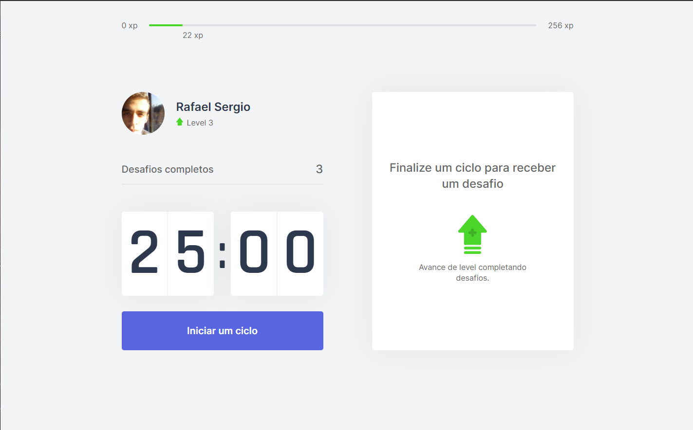
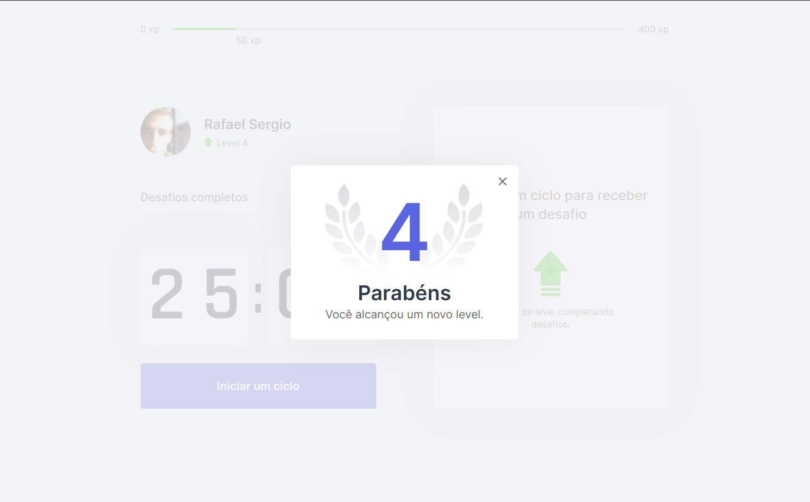

# Move.it

<p>
  
  
  
  <a href="https://opensource.org/licenses/MIT">
    
  </a>
  <a href="https://github.com/rafaelone/Move.It/commits/master">
    
  </a>
</p>

## Tópicos

[Sobre o Move.it](#sobre-o-Move.it)

[Tecnologias](#tecnologias)

[Instalação e uso](#instalação-e-uso)

[Licença](#licença)

<br>

## Sobre o Move.it

O Move.it é um App que utiliza a técnica de [pomodoro](https://pt.wikipedia.org/wiki/T%C3%A9cnica_pomodoro), com o objetivo de melhorar sua produtividade e foco. Desenvolvido durante a Next Level Week #4 da [Rocketseat](https://rocketseat.com.br/).

<br>

<p align="center">
  <a href="https://www.figma.com/file/n9J6604nMGB7Cgt2vEVtWb/Move.it-1.0-Dark-Mode">
    
  </a>
</p>

<br>

<div>
  
</div>

<div>
    
</div>

<br>

## Tecnologias

Tecnologias e ferramentas utilizadas no desenvolvimento do projeto:

- [React](https://reactjs.org/)
- [Next.js](https://nextjs.org/)
- [TypeScript](https://www.typescriptlang.org/)

<br>

## Instalação e uso

```bash
# Abra um terminal e copie este repositório com o comando
$ git clone https://github.com/rafaelone/Move.it.git
# ou use a opção de download.

# Entre na pasta web com
$ cd Move.it

# Instale as dependências
$ yarn install

# Rode o aplicação
$ yarn start
```

<br>

## Licença

<a href="https://opensource.org/licenses/MIT">
    
</a>

<br>

Esse projeto está sob a licença MIT. Veja o arquivo [LICENSE](/LICENSE) para mais detalhes.

---

Feito com ❤ by [Rafael Sergio](https://github.com/rafaelone)

[](https://www.linkedin.com/in/rafael-sergio-982951103/)
